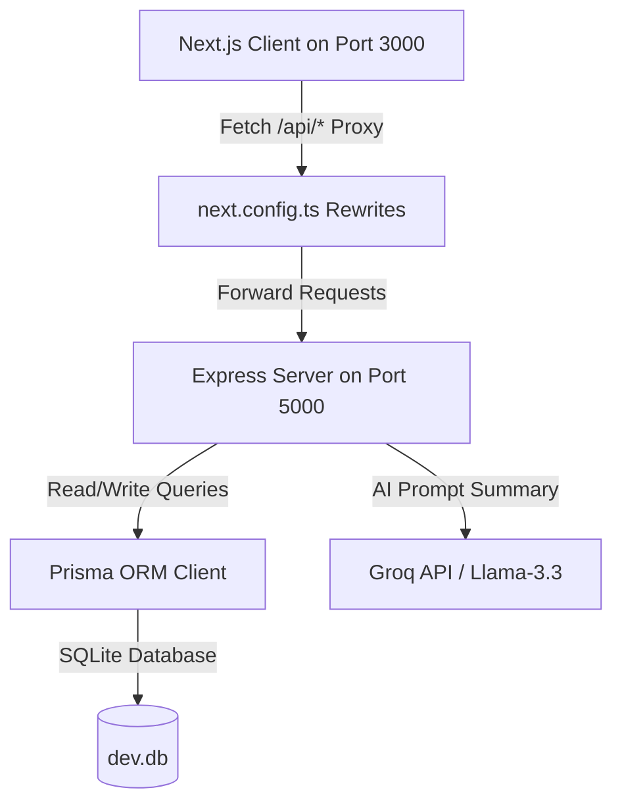

# 🌍 EcoSphere — ESG Management & Gamification Platform

EcoSphere is a state-of-the-art ESG (Environmental, Social, Governance) Management Platform that turns corporate sustainability targets into engaging, gamified experiences. It features a complete scoring engine, real-time carbon emission calculations, automated policy acknowledgments, dynamic leaderboard ranks, and an AI-powered organizational health advisor.

---

## 🚀 Key Highlights & Tech Stack

- **Frontend Client**: Next.js 15 (App Router), React, Recharts, persistent Local Storage theme toggling (Dark & Light Mode).
- **Backend API Server**: Express.js, TypeScript, NodeJS.
- **Database / ORM**: SQLite database managed via Prisma ORM.
- **AI Engine**: Groq SDK powered by `llama-3.3-70b-versatile` for live ESG insight generation.
- **Auth & Session**: Cookie-based JWT authentication with bcrypt password hashing.

---

## 🛠️ Architecture Overview

EcoSphere uses a decoupled client-server architecture:



1. **Frontend Client (`/`)**: A Next.js static client that communicates with local paths (e.g. `fetch('/api/auth/me')`). The developer proxy configuration in `next.config.ts` transparently routes `/api/:path*` to `http://localhost:5000/api/:path*`.
2. **Backend API Server (`/backend`)**: A robust Express API server running on port `5000` with direct access to Prisma and the database instance.

---

## 📊 Database Schema (Prisma)

The SQLite database structure includes 22 interlinked models:

- **Core / Auth**: `User` (tracks XP, points balance, credentials), `Department` (hierarchical parent-child organization), `ESGConfig` (custom system weights).
- **Environmental**: `CarbonTransaction` (footprint logs), `EmissionFactor` (carbon lookup values), `EnvironmentalGoal` (target progress goals), `ProductESGProfile` (packaging/product metrics).
- **Social**: `CSRActivity` (volunteer projects), `EmployeeParticipation` (joined volunteer logs).
- **Governance**: `ESGPolicy` (rules & codes of conduct), `PolicyAcknowledgement` (employee checkmarks), `Audit` (external reviews), `ComplianceIssue` (tracked issues with owner/deadlines).
- **Gamification**: `Challenge` (sustainability quests), `ChallengeParticipation` (user progression), `Badge` (unlocked milestones), `UserBadge` (awarded badge list), `Reward` (redeemable merchandise), `RewardRedemption` (user claims).
- **Analytics & Alerts**: `DepartmentScore` (historical metrics), `Notification` (system-wide alert cards).

---

## 🌟 Core Features

### 1. Unified Dashboard
- **Dynamic KPIs**: Instant widgets presenting environmental footprints, compliance rates, community participation ratios, and overall scores.
- **Visual Trends**: Emissions line charts and department ESG performance bar charts.
- **Leaderboard Rankings**: Highlights active teams and top-performing departments.
- **Groq AI ESG Insights**: Press the insight button to run Groq completion summarizing organizational health and recommending improvements.

### 2. Environmental Module
- **Carbon Transactions**: Logs carbon footprint transactions (e.g. shipping, server runtime, travel) and calculates CO2e automatically.
- **Emission Factors Editor**: Configures emission multiplier ratios (e.g., kg CO2e per kWh) in real time.
- **Goals Tracker**: Progress bar gauges representing progress against custom target ceilings.

### 3. Social & CSR Module
- **CSR Activities**: Interactive lists of corporate activities. Users can join volunteer opportunities and log contributions.
- **Approval Queue**: Administrative panels to approve or reject employee volunteer logs.
- **Diversity Analytics**: Visual breakdown graphs of team distributions.

### 4. Governance & Policy Module
- **Compliance Issues Tracker**: Track compliance violations, assign internal owners, set deadlines, and assess overdue penalties automatically.
- **Policy Acknowledgments**: Publishes corporate guidelines with a checklist for employees to sign off.
- **Audit Registry**: Track completed audits and record compliance feedback.

### 5. Gamification System
- **Milestone Challenges**: Join active green challenges (e.g., "Cycle to work week") with progress increments.
- **Badge Awarding Engine**: Automatically triggers upon XP updates, checking rules against thresholds.
- **EcoPoints Store**: Redeem points for custom merchandise (e.g. eco-bottles, solar chargers) with stock deduction guards.

### 6. Custom Reports Builder
- Standardized tabs for **Environmental**, **Social**, and **Governance** indicators.
- **Filter Suite**: Combine filters for Department, Date Range, Module, Employee, Challenge, and ESG Category to fetch custom tables.
- **Exporting**: Supports CSV downloads of custom report results.

---

## ⚙️ Core Business Rules & Calculations

### 1. ESG Scoring Formulas
Department scores are updated continuously based on actions:
- **Environmental Score**: Evaluated against active goals. A score out of 100 derived from the percentage by which current emissions remain below target caps.
- **Social Score**: Evaluated against employee CSR engagement ratio (Total participants / Total employees) and average volunteer hours.
- **Governance Score**: Calculated as:
  $$\text{Score} = \text{Resolved Ratio} \times 100 - (\text{Overdue Penalty} \times 10)$$
  *(Each unresolved compliance issue that exceeds its deadline incurs a -10 penalty).*
- **Overall Score**: Weighted combination of E, S, and G scores. Weights are configurable via settings sliders.

### 2. Gamification Levels
- **XP Progression**: Employees gain XP by completing challenges and participating in CSR activities.
- **Leveling Up**: Level is calculated as:
  $$\text{Level} = \left\lfloor \frac{\text{Total XP}}{100} \right\rfloor + 1$$
- **Badge triggers**: Unlocking badges awards instant XP bonuses.

---

## 🚀 Getting Started

### 📋 Prerequisites
- Node.js (version 18 or above recommended)
- NPM or Yarn package manager

---

### 💾 1. Backend Setup

1. Navigate to the backend directory:
   ```bash
   cd backend
   ```

2. Install dependencies:
   ```bash
   npm install
   ```

3. Configure your environment variables. Create a `.env` file in the `/backend` folder:
   ```env
   PORT=5000
   DATABASE_URL="file:./dev.db"
   JWT_SECRET="YOUR_SUPER_SECRET_JWT_KEY"
   GROQ_API_KEY="YOUR_GROQ_LLAMA_KEY"
   ```

4. Initialize the Prisma database schema and run migrations:
   ```bash
   npx prisma migrate dev --name init
   ```

5. Seed the database with initial metrics, default departments, users, and challenges:
   ```bash
   npm run seed
   ```

6. Start the development server on port `5000`:
   ```bash
   npm run dev
   ```

---

### 🖥️ 2. Frontend Client Setup

1. Navigate to the frontend directory:
   ```bash
   cd frontend
   ```

2. Install dependencies:
   ```bash
   npm install
   ```

3. Start the Next.js development server on port `3000`:
   ```bash
   npm run dev
   ```

4. Open your browser and navigate to `http://localhost:3000`.

---

## 🔑 Seeded Demo Account Credentials
For testing purposes, sign in using these accounts (password is `password123` for all):
- **Admin**: `admin@ecosphere.com`
- **Manager (Logistics)**: `neha@ecosphere.com`
- **Manager (Manufacturing)**: `vikram@ecosphere.com`
- **Manager (Corporate)**: `amit@ecosphere.com`
- **Employee (Logistics)**: `riyer@ecosphere.com`
- **Employee (Corporate)**: `amehta@ecosphere.com`

---

## 📁 Repository Directory Structure

```text
ecoshpere_management/
├── backend/                  # Express API Server
│   ├── prisma/               # SQLite database & Prisma Schema config
│   │   ├── dev.db            # Active SQLite database instance
│   │   └── schema.prisma
│   ├── src/
│   │   ├── lib/              # Business rules (scoring, badge awarding, JWT auth)
│   │   ├── index.ts          # Main Express routing controller
│   │   └── seed.ts           # Seeding routines
│   ├── package.json
│   └── tsconfig.json
├── frontend/                 # Next.js Frontend Client
│   ├── src/                  # App components & layout
│   │   ├── app/              # App Router pages (Dashboard, Gamification, Reports, etc.)
│   │   └── components/       # UI elements (Sidebar, theme toggle)
│   ├── public/               # Static assets
│   ├── package.json
│   ├── next.config.ts
│   └── tsconfig.json
```

---

## 🎖️ Hackathon Developer Command Reference
Below are shortcuts configured for rapid testing:
- `cd frontend && npm run build`: Compiles Next.js frontend, performing strict type checks.
- `cd backend && npm run build`: Compiles server-side typescript configurations.
- `cd backend && npx prisma studio`: Opens the visual SQLite browser to manually verify row operations.
